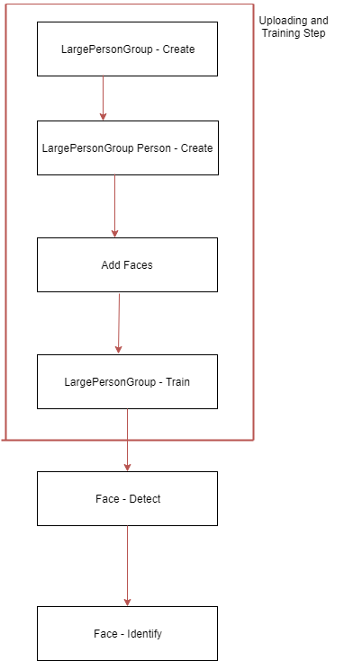

# Face-Hack

This project aims to test some Cognitive services API's, searching for a person inside a group trained before.
The whole pipeline of constructing a model and checking if a person exists there, is shown above:

